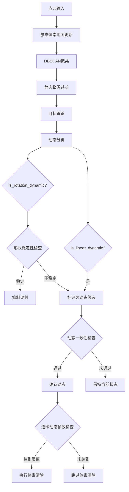

# 设计文档

## 概述

本设计文档描述了修复静态体素地图构建中静态物体误判问题的技术方案。核心思路是通过最小化代码改动，在现有架构基础上增加三个关键机制：

1. **动态一致性检查前置**：将体素清除操作与动态一致性检查绑定
2. **`is_rotation_dynamic` 误判抑制**：基于点云形状稳定性抑制误判
3. **静态恢复加速**：加速误判区域的静态标记恢复

## 架构

本方案采用最小侵入式设计，主要修改以下两个文件：
- `dynamicDetector.cpp`：修改 `classificationCB` 函数中的动态判定逻辑
- `staticPointFilter.cpp`：优化体素累积和清除策略



## 组件和接口

### 1. 动态分类器（dynamicDetector）

**修改函数：** `classificationCB`

**新增成员变量：**
```cpp
// 每个轨迹连续被确认为动态的帧数计数器
std::vector<int> confirmedDynamicFrames_;
// 触发体素清除所需的连续动态帧数阈值
int voxelClearDynamicFrames_;
// 形状稳定性检查的PCA变化率阈值
double shapeStabilityThreshold_;
```

**接口变更：** 无新增公共接口，仅内部逻辑调整

### 2. 静态点滤波器（StaticPointFilter）

**修改函数：** `clearDynamicRegions`

**接口变更：** 无变更，保持现有接口

## 数据模型

### 新增配置参数

| 参数名 | 类型 | 默认值 | 描述 |
|--------|------|--------|------|
| `voxel_clear_dynamic_frames` | int | 5 | 触发体素清除所需的连续动态帧数 |
| `shape_stability_threshold` | double | 0.3 | 形状稳定性检查的PCA变化率阈值 |

## 正确性属性

*正确性属性是指在系统所有有效执行中都应保持为真的特征或行为——本质上是关于系统应该做什么的形式化陈述。属性作为人类可读规范和机器可验证正确性保证之间的桥梁。*

### Property 1: 动态一致性检查前置保证

*对于任意* 被首次判定为动态的物体，只有当其连续 `voxel_clear_dynamic_frames` 帧都被确认为动态时，才会触发体素清除操作
**验证: 需求 1.1, 1.2, 1.3**

### Property 2: 形状稳定性抑制误判

*对于任意* 触发 `is_rotation_dynamic` 条件的物体，如果其点云PCA标准差变化率低于 `shape_stability_threshold`，则该判定被抑制
**验证: 需求 2.1, 2.2**

### Property 3: 遮挡检测正确性

*对于任意* 物体，如果其历史尺寸变化超过阈值（`sizeMergeThresh_`），则 `is_rotation_dynamic` 判定被抑制
**验证: 需求 2.3**

### Property 4: 静态恢复机制

*对于任意* 曾被误判为动态的体素区域，当该区域连续未被判定为动态时，其 hit_count 能够正常累积恢复
**验证: 需求 3.1, 3.2**

## 错误处理

1. **参数边界检查**：新增参数在初始化时进行边界检查，确保 `voxel_clear_dynamic_frames >= 1` 且 `shape_stability_threshold > 0`
2. **数组越界保护**：`confirmedDynamicFrames_` 向量在轨迹创建/删除时同步更新
3. **除零保护**：PCA变化率计算时检查分母是否为零

## 测试策略

### 双重测试方法

本方案采用单元测试和属性测试相结合的方式：

**单元测试**：
- 验证新增参数的正确加载
- 验证 `confirmedDynamicFrames_` 计数器的正确更新
- 验证形状稳定性检查的边界条件

**属性测试**：
- 使用 Google Test 框架
- 每个属性测试运行至少100次迭代
- 测试标注格式：`**Feature: static-voxel-map-fix, Property {number}: {property_text}**`

### 属性测试要求

1. 选择 Google Test 作为测试框架（与现有项目一致）
2. 每个正确性属性对应一个独立的属性测试
3. 测试需覆盖边界条件和典型场景
