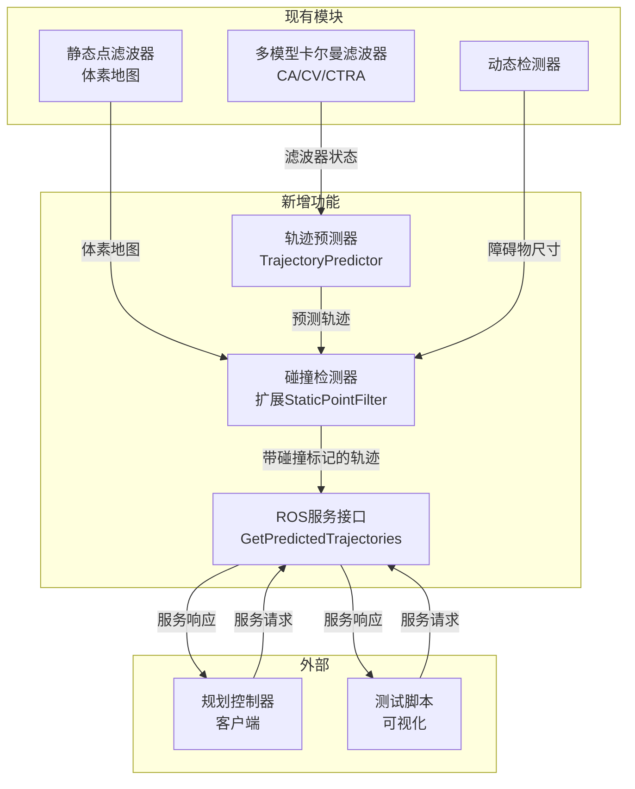

# 设计文档

## 概述

本设计扩展现有的动态障碍物检测系统，添加长期轨迹预测功能。核心思路是复用现有的多模型卡尔曼滤波器状态进行多步外推，并扩展静态点滤波器实现轨迹碰撞检测。设计目标是最小化代码改动量，同时提供完整的预测轨迹服务。

## 架构

### 系统架构图



### 数据流

1. 规划控制器发送服务请求，指定查询范围、预测时域和时间步长
2. 服务处理函数遍历所有动态障碍物的卡尔曼滤波器
3. 轨迹预测器根据滤波器状态进行多步外推
4. 碰撞检测器检查每个预测点是否与静态体素地图碰撞
5. 返回带碰撞标记的完整预测轨迹

## 组件与接口

### 1. 轨迹预测器（TrajectoryPredictor）

**职责**：基于卡尔曼滤波器状态进行多步轨迹外推

**设计决策**：不创建独立类，而是在`dynamicDetector`中添加内联预测函数，减少代码复杂度。

**预测算法**：
- **CA模型（人/无人机）**：使用恒加速度运动学方程
  - `x(t) = x0 + vx*t + 0.5*ax*t²`
  - `y(t) = y0 + vy*t + 0.5*ay*t²`
  - `z(t) = z0 + vz*t + 0.5*az*t²`（无人机）或 `z(t) = z0`（人）
  
- **CV模型（其他）**：使用恒速度运动学方程
  - `x(t) = x0 + vx*t`
  - `y(t) = y0 + vy*t`
  - `z(t) = z0 + vz*t`
  
- **CTRA模型（车辆）**：使用恒转弯率和加速度方程
  - 当 `|ω| > ε`（转弯）：
    - `x(t) = x0 + (v/ω)*(sin(θ0+ω*t) - sin(θ0)) + (a/ω²)*(cos(θ0) - cos(θ0+ω*t) + ω*t*sin(θ0+ω*t))`
    - `y(t) = y0 + (v/ω)*(-cos(θ0+ω*t) + cos(θ0)) + (a/ω²)*(sin(θ0) - sin(θ0+ω*t) + ω*t*cos(θ0+ω*t))`
  - 当 `|ω| ≤ ε`（直行）：退化为CA模型

**协方差传播**：
- 使用状态转移矩阵F和过程噪声Q进行协方差传播
- `P(t+dt) = F * P(t) * F' + Q`
- 提取位置协方差的对角元素作为不确定性

### 2. 碰撞检测器（扩展StaticPointFilter）

**职责**：检查预测轨迹点是否与静态体素地图发生碰撞

**新增接口**：
```cpp
// 检查单个点是否与静态地图碰撞
bool checkCollision(const Eigen::Vector3d& point);

// 检查带尺寸的包围框是否与静态地图碰撞
bool checkBoxCollision(const Eigen::Vector3d& center, 
                       const Eigen::Vector3d& size,
                       double inflation = 0.0);
```

**碰撞检测算法**：
1. 将预测点转换为体素坐标
2. 根据障碍物尺寸计算需要检查的体素范围
3. 遍历范围内的体素，检查是否存在静态标记的体素
4. 支持膨胀系数，用于安全裕度

### 3. ROS服务接口

**新增服务定义** `GetPredictedTrajectories.srv`：

```
# 请求
geometry_msgs/Point current_position    # 机器人当前位置
float64 range                           # 查询范围（米）
float64 prediction_horizon              # 预测时域（秒），默认3.0
float64 prediction_dt                   # 预测时间步长（秒），默认0.2
---
# 响应（每个障碍物一组轨迹）
uint32[] obstacle_ids                   # 障碍物ID列表
geometry_msgs/Vector3[] current_positions    # 当前位置
geometry_msgs/Vector3[] current_velocities   # 当前速度
geometry_msgs/Vector3[] sizes                # 障碍物尺寸
uint32[] trajectory_lengths             # 每个障碍物的轨迹点数（碰撞截断后的实际长度）
geometry_msgs/Vector3[] trajectory_positions # 所有轨迹点位置（扁平化）
geometry_msgs/Vector3[] trajectory_velocities # 所有轨迹点速度（扁平化）
geometry_msgs/Vector3[] position_covariances # 位置协方差（扁平化）
```

**设计说明**：
- 使用扁平化数组存储多个障碍物的轨迹，通过`trajectory_lengths`指示每个障碍物的轨迹点数
- 轨迹在碰撞点处截断，`trajectory_lengths`反映截断后的实际长度
- 这种设计避免了ROS消息中嵌套数组的复杂性

### 4. 测试可视化脚本

**文件**：`scripts/test_trajectory_prediction.py`

**功能**：
- 周期性调用预测服务
- 发布Marker消息到RViz
- 轨迹线：LINE_STRIP类型，显示预测轨迹（碰撞截断后的有效轨迹）
- 不确定性椭圆：SPHERE类型，根据协方差缩放

## 数据模型

### 预测轨迹点结构

```cpp
struct TrajectoryPoint {
    Eigen::Vector3d position;      // 预测位置
    Eigen::Vector3d velocity;      // 预测速度
    Eigen::Vector3d covariance;    // 位置协方差对角元素
    double timestamp;              // 相对时间戳
};
```

**说明**：轨迹在碰撞点处截断，因此不需要碰撞标记字段。

### 配置参数

在`detector_param.yaml`中新增：

```yaml
# 轨迹预测参数
trajectory_prediction:
  default_horizon: 3.0        # 默认预测时域（秒）
  default_dt: 0.2             # 默认预测步长（秒）
  collision_inflation: 0.1    # 碰撞检测膨胀系数（米）
  max_trajectory_points: 30   # 最大轨迹点数限制
```


## 正确性属性

*属性是系统在所有有效执行中应保持为真的特征或行为——本质上是关于系统应该做什么的形式化陈述。属性作为人类可读规范和机器可验证正确性保证之间的桥梁。*

### 属性1：轨迹点数量一致性

*对于任意*有效的预测时域horizon和时间步长dt，返回的轨迹点数量应等于`floor(horizon/dt) + 1`

**验证: 需求 1.1, 1.4**

### 属性2：轨迹数据完整性

*对于任意*服务响应中的轨迹点，该点必须同时包含有效的位置向量、速度向量和协方差向量（所有分量均为有限数值）

**验证: 需求 1.2**

### 属性3：碰撞截断正确性

*对于任意*预测轨迹，如果轨迹被截断，则截断点之前的所有轨迹点均不与静态体素地图发生碰撞

**验证: 需求 2.2, 2.4**

### 属性4：轨迹长度有效性

*对于任意*预测轨迹，其长度应大于等于1（至少包含起始点）且小于等于预期的最大轨迹点数

**验证: 需求 2.4**

### 属性5：无效参数处理

*对于任意*包含无效参数（horizon<=0或dt<=0）的服务请求，系统应使用默认参数值生成轨迹，而非返回错误或空结果

**验证: 需求 3.4**

### 属性6：空障碍物处理

*对于任意*没有动态障碍物的场景，服务调用应返回成功（返回true），且轨迹列表为空

**验证: 需求 3.3**

## 错误处理

### 服务层错误处理

| 错误场景 | 处理方式 |
|---------|---------|
| 无效的预测时域（<=0） | 使用默认值`default_horizon` |
| 无效的时间步长（<=0） | 使用默认值`default_dt` |
| 无效的查询范围（<=0） | 使用默认值10.0米 |
| 滤波器未初始化 | 跳过该障碍物，继续处理其他障碍物 |
| 无动态障碍物 | 返回成功，轨迹列表为空 |

### 预测层错误处理

| 错误场景 | 处理方式 |
|---------|---------|
| 协方差矩阵非正定 | 使用单位矩阵替代 |
| 预测位置包含NaN/Inf | 截断轨迹，返回已计算的有效点 |
| 轨迹点数超过最大限制 | 截断到`max_trajectory_points` |

### 碰撞检测层错误处理

| 错误场景 | 处理方式 |
|---------|---------|
| 体素地图为空 | 所有点标记为无碰撞 |
| 点坐标超出地图范围 | 标记为无碰撞 |

## 测试策略

### 单元测试

使用Google Test框架进行单元测试：

1. **轨迹预测函数测试**
   - 测试CA模型预测的数学正确性
   - 测试CV模型预测的数学正确性
   - 测试CTRA模型预测的数学正确性（包括直行和转弯情况）

2. **碰撞检测函数测试**
   - 测试点碰撞检测的正确性
   - 测试带尺寸膨胀的碰撞检测
   - 测试边界情况（点恰好在体素边界上）

3. **服务参数验证测试**
   - 测试无效参数的默认值替换

### 属性测试

使用RapidCheck库进行属性测试（C++ Property-Based Testing）：

**测试框架配置**：
- 每个属性测试运行至少100次迭代
- 使用随机生成的输入参数

**属性测试标注格式**：
```cpp
// **Feature: trajectory-prediction-service, Property {number}: {property_text}**
```

**属性测试列表**：

1. **Property 1: 轨迹点数量一致性**
   - 生成随机的horizon (0.5-10.0秒) 和 dt (0.1-1.0秒)
   - 验证返回的轨迹点数等于 floor(horizon/dt) + 1

2. **Property 2: 轨迹数据完整性**
   - 生成随机的滤波器状态
   - 验证所有轨迹点的位置、速度、协方差均为有限数值

3. **Property 3: 碰撞截断正确性**
   - 生成随机的体素地图和预测轨迹
   - 验证截断点之前的所有轨迹点均不与静态地图碰撞

4. **Property 4: 轨迹长度有效性**
   - 生成随机的预测参数
   - 验证轨迹长度在有效范围内（1 <= length <= max_points）

5. **Property 5: 无效参数处理**
   - 生成无效参数（负数、零、NaN）
   - 验证系统使用默认值正常工作

6. **Property 6: 空障碍物处理**
   - 在无动态障碍物场景下调用服务
   - 验证返回成功且轨迹列表为空

### 集成测试

通过测试脚本`test_trajectory_prediction.py`进行集成测试：

1. 启动检测器节点
2. 发布模拟的动态障碍物数据
3. 调用预测服务
4. 验证响应数据的正确性
5. 可视化预测轨迹和不确定性椭圆
